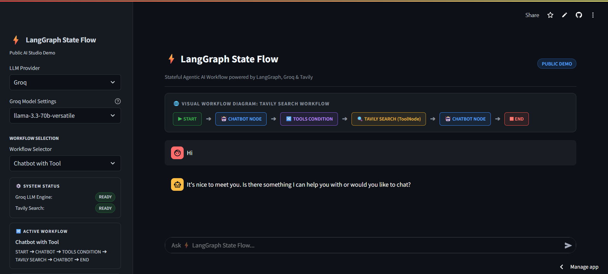

# Agentic AI Workflow with LangGraph

A Streamlit-based demonstration of building stateful, tool-enabled conversational AI workflows using LangGraph and LangChain, powered by the Groq API for LLM inference and Tavily for web search.

---

## Overview

This project demonstrates how to construct and run stateful AI agent workflows with [LangGraph](https://www.langgraph.com/) and [LangChain](https://python.langchain.com/). It provides two selectable use cases through a Streamlit web interface:

1. **Basic Chatbot** — A single-node conversational workflow that sends user messages to a Groq LLM and returns the response.
2. **Chatbot with Tool** — An agent that can invoke a Tavily web-search tool when the LLM determines a search is needed, then continue the conversation with the tool results.

The project illustrates core LangGraph concepts: state management via a `TypedDict` with a message-reducer, node composition, conditional routing with `tools_condition`, and tool binding with `ToolNode`.

---

## Key Features

| Feature | Description |
|---|---|
| **Basic Chatbot** | Single-node graph: `START → chatbot → END`. Sends user input to a Groq LLM and returns the response. |
| **Chatbot with Tool** | Two-node graph with conditional routing: `START → chatbot → (tools_condition) → tools → chatbot`. The LLM can decide to call Tavily web search, and the tool results are fed back into the conversation. |
| **LangGraph State Graph** | Uses `StateGraph` with a `State` TypedDict whose `messages` field uses the `add_messages` reducer for automatic message accumulation. |
| **Conditional Routing** | `tools_condition` from `langgraph.prebuilt` routes between the chatbot node and the tool node based on whether the LLM emitted a tool call. |
| **LLM Tool Binding** | `ChatGroq.bind_tools()` attaches the Tavily search tool to the LLM so it can decide when to search. |
| **Tavily Web Search** | `TavilySearchResults(max_results=2)` provides real-time web search capability. |
| **Streamlit Interface** | Sidebar for LLM/model/use-case selection and API key entry; main panel for chat interaction. |
| **Automated Tests** | 18 pytest tests covering state, nodes, graph construction, config, and LLM initialization. |

---

## Architecture

```
┌─────────────────────────────────────────────────────────┐
│                    Streamlit UI (app.py)                 │
│                                                         │
│  ┌──────────────┐    ┌──────────────┐    ┌───────────┐ │
│  │ LoadStreamlit│    │   GroqLLM    │    │ GraphBuilder│ │
│  │ UI (sidebar) │───▶│  (ChatGroq)  │───▶│ (StateGraph)│ │
│  └──────────────┘    └──────────────┘    └─────┬─────┘ │
│                                                 │       │
│                                                 ▼       │
│  ┌─────────────────────────────────────────────────────┐ │
│  │              DisplayResultStreamlit                  │ │
│  │  Renders chat messages in the Streamlit main panel   │ │
│  └─────────────────────────────────────────────────────┘ │
└─────────────────────────────────────────────────────────┘
```

### LangGraph Graph Structures

**Basic Chatbot:**
```
START → [chatbot] → END
```

**Chatbot with Tool:**
```
START
  |
  v
[chatbot]
  |
  +-- tools_condition --+--> [tools] --> [chatbot]
                        |
                        +--> END
```

### Component Map

| Module | Responsibility |
|---|---|
| `app.py` | Entry point — calls `load_langgraph_agenticai_app()` |
| `main.py` | Orchestrates UI loading, LLM config, graph building, and result display |
| `graph/graph_builder.py` | `GraphBuilder` — constructs and compiles the LangGraph `StateGraph` |
| `nodes/basic_chatbot_node.py` | `BasicChatbotNode` — wraps `llm.invoke()` for the basic chatbot |
| `nodes/chatbot_with_Tool_node.py` | `ChatbotWithToolNode` — binds tools to the LLM and returns a node function |
| `state/state.py` | `State` TypedDict with `messages: Annotated[list, add_messages]` |
| `tools/serach_tool.py` | `get_tools()` / `create_tool_node()` — Tavily search tool and `ToolNode` |
| `LLMS/groqllm.py` | `GroqLLM` — initializes `ChatGroq` with user-provided API key and model |
| `ui/streamlitui/loadui.py` | `LoadStreamlitUI` — builds the Streamlit sidebar UI |
| `ui/streamlitui/display_result.py` | `DisplayResultStreamlit` — streams and renders graph output |
| `ui/uiconfigfile.py` | `Config` — reads `uiconfigfile.ini` for UI options |

---

## Workflow

### Basic Chatbot

1. User enters a message in the Streamlit chat input.
2. `main.py` initializes a `GroqLLM` with the user's API key and selected model.
3. `GraphBuilder.setup_graph("Basic Chatbot")` builds a graph with a single `chatbot` node.
4. The graph is compiled and invoked with the user's message.
5. `DisplayResultStreamlit` streams the LLM response and renders it in the chat.

### Chatbot with Tool

1. User enters a message in the Streamlit chat input.
2. `main.py` initializes a `GroqLLM` and builds the tool-enabled graph.
3. `GraphBuilder.setup_graph("Chatbot with Tool")` creates:
   - A `chatbot` node (LLM with `bind_tools` applied)
   - A `tools` node (`ToolNode` wrapping `TavilySearchResults`)
   - An edge from `START` to `chatbot`
   - A conditional edge from `chatbot` using `tools_condition`
   - An edge from `tools` back to `chatbot`
4. The graph is compiled and invoked with the user's message.
5. If the LLM emits a tool call, `tools_condition` routes to the `tools` node, which executes the Tavily search. The tool result is fed back to the `chatbot` node for a final response.
6. `DisplayResultStreamlit` renders each message type (HumanMessage, ToolMessage, AIMessage) in the appropriate chat bubble.

---

## Technology Stack

| Layer | Technology |
|---|---|
| Language | Python 3.12 |
| Agent Framework | LangGraph 0.2.67 |
| LLM Orchestration | LangChain 0.3.25 / LangChain Core 0.3.65 |
| LLM Provider | Groq (`langchain_groq` 0.2.5, `ChatGroq`) |
| Web Search Tool | Tavily (`langchain_community` 0.3.25, `TavilySearchResults`) |
| UI Framework | Streamlit 1.42.0 |
| Testing | pytest 8.3.4 |
| CI/CD | GitHub Actions (push to Hugging Face Spaces) |

---

## Project Structure

```
Agenticai_langgraph_project/
├── app.py                              # Entry point
├── requirements.txt                    # Pinned dependencies
├── README.md                           # This file
├── LICENSE                             # Apache 2.0
├── .gitignore
├── .github/
│   └── workflows/
│       └── main.yml                    # CI/CD: sync to Hugging Face Spaces
├── src/
│   ├── __init__.py
│   └── langgraphagenticai/
│       ├── main.py                     # App orchestration
│       ├── LLMS/
│       │   └── groqllm.py              # Groq LLM initialization
│       ├── graph/
│       │   └── graph_builder.py        # LangGraph StateGraph construction
│       ├── nodes/
│       │   ├── basic_chatbot_node.py   # Basic chatbot node
│       │   └── chatbot_with_Tool_node.py  # Tool-enabled chatbot node
│       ├── state/
│       │   └── state.py                # State TypedDict
│       ├── tools/
│       │   └── serach_tool.py          # Tavily search tool + ToolNode
│       └── ui/
│           ├── uiconfigfile.py         # Config reader
│           ├── uiconfigfile.ini        # UI configuration
│           └── streamlitui/
│               ├── loadui.py           # Streamlit sidebar UI
│               └── display_result.py   # Result rendering
└── tests/
    ├── conftest.py                     # Pytest configuration
    ├── test_state.py                   # State TypedDict tests
    ├── test_nodes.py                   # Node tests
    ├── test_graph_builder.py           # Graph builder tests
    ├── test_config.py                  # Config tests
    └── test_groqllm.py                 # LLM initialization tests
```

---

## Installation

### Prerequisites

- Python 3.12+
- A Groq API key ([console.groq.com](https://console.groq.com/keys))
- A Tavily API key ([app.tavily.com](https://app.tavily.com/home)) — required only for the "Chatbot with Tool" use case

### Setup

```bash
# Clone the repository
git clone https://github.com/KooshkTech/Agenticai_langgraph_project.git
cd Agenticai_langgraph_project

# Create and activate a virtual environment
python -m venv venv
source venv/bin/activate        # Linux/macOS
# or
venv\Scripts\activate           # Windows

# Install dependencies
pip install -r requirements.txt
```

---

## Environment Variables / API Keys

API keys are **not** stored in the repository. They are entered at runtime through the Streamlit sidebar:

| Key | Used By | Required For |
|---|---|---|
| `GROQ_API_KEY` | `GroqLLM` → `ChatGroq` | Both use cases |
| `TAVILY_API_KEY` | `TavilySearchResults` | "Chatbot with Tool" only |

The application reads these from the Streamlit text inputs in the sidebar. The `TAVILY_API_KEY` is also set as an environment variable (`os.environ`) at runtime so that `TavilySearchResults` can access it.

**Never commit API keys to version control.** The `.gitignore` file excludes `.env` and `.env.*` files.

---

## Running Locally

```bash
# Activate the virtual environment (if not already active)
source venv/bin/activate        # Linux/macOS
# or
venv\Scripts\activate           # Windows

# Run the Streamlit app
streamlit run app.py
```

The application will open in your default browser. Select a use case from the sidebar, enter your API keys, and start chatting.

---

## Testing

The project includes a pytest test suite covering the core logic:

```bash
# Run all tests
python -m pytest tests/ -v

# Run a specific test file
python -m pytest tests/test_nodes.py -v
```

**Current test suite: 18 tests** across 5 test files:

| Test File | Tests | Coverage |
|---|---|---|
| `test_state.py` | 2 | `State` TypedDict structure and `add_messages` reducer |
| `test_nodes.py` | 5 | `BasicChatbotNode.process()` and `ChatbotWithToolNode.create_chatbot()` |
| `test_graph_builder.py` | 3 | `GraphBuilder.setup_graph()` for all use case paths |
| `test_config.py` | 5 | `Config` INI file reading and file-relative path resolution |
| `test_groqllm.py` | 3 | API key validation, error handling, and LLM initialization |

Tests use `unittest.mock` to mock the LLM and external dependencies, so no API keys are required to run the test suite.

**Note for Windows users:** If you encounter a `zstandard` DLL loading error when running tests, the `tests/conftest.py` file includes a workaround that injects a mock for the `zstandard` module. You may also need to set `PYTEST_DISABLE_PLUGIN_AUTOLOAD=1` to prevent the `langsmith` pytest plugin from loading.

---

## CI/CD

The project includes a GitHub Actions workflow (`.github/workflows/main.yml`) that triggers on every push to the `main` branch. The workflow is intended to synchronize the repository with a Hugging Face Space using a `HF_TOKEN` secret:

1. Checks out the repository
2. Runs `git filter-branch` to remove a large PDF file from history
3. Pushes the repository to a Hugging Face Space using a `HF_TOKEN` secret

**Deployment status:** The deployment configuration is currently under review. No live demo is claimed until the deployment is verified.

---

## Technical Design Decisions

1. **State management via `add_messages` reducer:** The `State` TypedDict uses `Annotated[list, add_messages]` so that LangGraph automatically appends new messages to the state without manual list manipulation in each node.

2. **Two use cases, one `StateGraph` instance:** `GraphBuilder` creates a single `StateGraph(State)` and adds nodes/edges based on the selected use case. This keeps the code DRY while supporting both simple and tool-enabled workflows.

3. **Tool binding at node creation time:** `ChatbotWithToolNode.create_chatbot()` calls `self.llm.bind_tools(tools)` once when the node function is created, rather than on every invocation. This is more efficient and follows LangChain best practices.

4. **Configuration via INI file:** UI options (LLM choices, use cases, model names, page title) are externalized to `uiconfigfile.ini`, making it easy to add new options without code changes.

5. **API keys via Streamlit sidebar:** Keys are entered at runtime through the UI, never hardcoded. The `TAVILY_API_KEY` is set as an environment variable so `TavilySearchResults` can access it.

6. **Error handling in `main.py`:** The main function wraps LLM initialization and graph setup in try/except blocks, displaying user-friendly error messages via `st.error()` rather than crashing.

7. **Pinned dependencies:** All dependencies in `requirements.txt` are pinned to specific versions to ensure reproducible builds.

---

## Limitations

- **No RAG (Retrieval-Augmented Generation):** The project does not include document ingestion, vector storage, or retrieval pipelines.
- **No persistent memory:** The graph uses an in-memory `StateGraph` with no `MemorySaver` or checkpoint persistence. Each session starts with a fresh state.
- **Not a multi-agent architecture:** The project uses a single LLM node with tool calling, not multiple specialized agents coordinating.
- **Single LLM provider:** Only Groq is supported. Adding other providers (OpenAI, Anthropic, etc.) would require new LLM wrapper classes.
- **No authentication or rate limiting:** The Streamlit app has no user authentication or API rate limiting.
- **Deployment not verified:** The CI/CD workflow targets a Hugging Face Space, but the deployment configuration has not been verified and may need updates.
- **No token-level streaming:** The application streams graph/message output to the UI, but it does not currently implement token-level streaming from the LLM.
- **Filename typo:** The tools module is named `serach_tool.py` (should be `search_tool.py`).

---

## Future Improvements

The following are reasonable future enhancements, **not** currently implemented:

- **Add RAG capabilities:** Implement document ingestion, vector storage (e.g., FAISS or Chroma), and retrieval-augmented generation.
- **Add persistent memory:** Integrate `MemorySaver` or a database-backed checkpointer to maintain conversation history across sessions.
- **Add multi-agent architecture:** Implement specialized agents (e.g., researcher, coder, reviewer) that coordinate via LangGraph's agent patterns.
- **Add more LLM providers:** Support OpenAI, Anthropic, and other providers via a factory pattern.
- **Add streaming:** Stream LLM tokens to the UI in real-time using LangGraph's streaming capabilities.
- **Add authentication:** Implement user authentication for the Streamlit app.
- **Fix filename typo:** Rename `serach_tool.py` to `search_tool.py`.
- **Add integration tests:** Test the full end-to-end flow with mocked LLM responses.
- **Add linting and formatting:** Integrate `ruff` or `black` with pre-commit hooks.
- **Add type checking:** Integrate `mypy` for static type analysis.

---

## Screenshots

Screenshots are not currently available. Add screenshots of the Streamlit UI here once captured.
## ⚡ LangGraph State Flow

Stateful Agentic AI Workflow powered by LangGraph, Groq & Tavily.



### Features

- LangGraph StateGraph workflow
- Groq LLM integration
- Tavily web search
- ToolNode execution
- Stateful conversation
- User-provided API keys
- 18/18 tests passing
---

## License

This project is licensed under the Apache 2.0 License — see the [LICENSE](LICENSE) file for details.

---

## Author

AI Engineer portfolio project focused on stateful LLM workflows, tool calling, conditional routing, and LangGraph application architecture.

- **GitHub:** [KooshkTech](https://github.com/KooshkTech)
- **Repository:** [Agentic AI Workflow with LangGraph](https://github.com/KooshkTech/Agenticai_langgraph_project)
